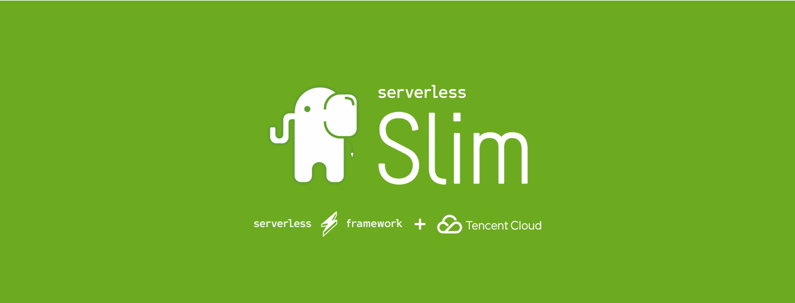

[](http://serverless.com)


Slim 4.* PHP tencent serverless component.

## Install serverless framework

```
npm i -g serverless
```

## Install Slimphp & components

```
composer install slim/slim
composer install slim/http
composer install guzzlehttp/psr7
composer install pimple/pimple
composer install slim/psr7
```

Make sure the `composer.json` file contains follow section:

```json
  "require": {
        "slim/slim": "^4.3",
        "slim/http": "^0.8.0",
        "ext-json": "*",
        "guzzlehttp/psr7": "^1.6",
        "pimple/pimple": "^3.2",
        "slim/psr7": "^0.6.0"
    }
```

## Create app.php & container.php

The project root must contain two files, `app.php` and `container.php`.

app.php:

```php
<?php

use Slim\Http\Response;
use GuzzleHttp\Psr7\Request;   // notice this request namespace
use Slim\Factory\AppFactory;

$app = AppFactory::create();

$app->get('/', function(Request $request, Response $response) {
    var_dump($this->get('event'));

    return $response->withJson([
        'hello' => 'serverless slim php.'
    ]);
});

return $app;
```


container.php

```php
<?php

$container = new \Pimple\Container();

// here define the dependencies

return $container;
```

> notice: don't require `autoload.php` in the head of any file.

## Configure the serverless

create the serverless configure file, serverless.yml:

```yml
# serverless.yml
 
slimphp:
  component: '@twn39/tencent-php-slim'
  inputs:
    region: ap-shanghai
```


## Deploy

```
serverless --debug
```

## Have fun !
